# 課題メタテンプレート

本リポジトリは、学生のプログラミング課題および課題採点用のCIを作成するための複数のプロンプトファイルを含むテンプレート・ツールキットです。  
GitHub Copilot Agents を使用して、初学者の学生が最先端のコーディング技術を身に付けることが出来るような課題リポジトリを効率的に作成できます。

## 対応言語/フレームワーク

本テンプレートは以下の言語/テストフレームワークに対応しています（拡張可能）：

| プロファイル | 言語 | テストフレームワーク | 状態 |
|-------------|-----|-------------------|------|
| `python-pytest` | Python 3.12 | pytest | ✅ 利用可能 |
| `java-junit` | Java 21 | JUnit 5 | 📋 計画中 |
| `javascript-jest` | Node.js 20 | Jest | 📋 計画中 |

新しい言語/フレームワークを追加する場合は、`lang-profiles/` ディレクトリにプロファイルを作成してください。
詳細は [lang-profiles/README.md](lang-profiles/README.md) を参照してください。

> **このファイルの位置づけ**: 本ファイルは教員向けの詳細なガイドです。リポジトリの構成、セットアップ手順、各プロンプトファイルの詳しい説明を記載しています。  
>
> **エージェント向け情報**: GitHub Copilot Agents の動作制御については **[AGENTS.md](AGENTS.md)** を参照してください。

## クイックスタート

テンプレートリポジトリを作成したら、以下の手順で課題作成を開始してください。

### 初回セットアップチェックリスト

- [ ] **テンプレートリポジトリの作成完了**
  - GitHub で「Use this template」から新規リポジトリを作成
  - Settings > General で「Template repository」を有効化

- [ ] **開発環境の準備**
  - GitHub Codespaces を起動、または
  - ローカル環境で依存関係をインストール（デフォルト: `pip install -r requirements-dev.txt`）

- [ ] **課題トピックの定義**
  - `agent-input/topics.md` を開く
  - 以下の項目を記入：
    - **使用言語/フレームワーク**（プロファイル選択）
    - 学習トピック一覧
    - 事前知識レベル
    - 学習目標
    - 難易度
    - 想定学習時間
    - 補足情報（任意）
    - チュートリアルの必要性

- [ ] **トピックのクリーンアップ**
  - GitHub Copilot Chat で `/topics.admin` を実行
  - `agent-input/topics.md` から入力例やコメントが削除されます

### 次のステップ

トピック定義が完了したら、以下のいずれかの方法で課題作成を進めてください：

- **シナリオ案を自動生成したい場合** → `/suggest-scenario.admin` を実行（Optional）
- **すぐに課題プランを作成したい場合** → `/plan.admin` を実行

詳細な手順は「[教員向け: GitHub Classroom 課題作成手順](#教員向け-github-classroom-課題作成手順)」を参照してください。

## リポジトリ構成

```text
.
├─ .devcontainer          # 開発コンテナ設定
├─ .github
│   ├─ prompts           # エージェント用プロンプトファイル
│   │   ├─ implement-test.admin.prompt.md # テスト実装と検証
│   │   ├─ plan.admin.prompt.md           # 課題プラン作成
│   │   ├─ readme.admin.prompt.md         # release/README.md 作成
│   │   ├─ release.admin.prompt.md        # リリース準備
│   │   ├─ suggest-scenario.admin.prompt.md # シナリオ案提案（Optional）
│   │   ├─ topics.admin.prompt.md         # トピック整理
│   │   ├─ tutorial.admin.prompt.md       # TUTORIAL.md 作成
│   │   └─ verify.admin.prompt.md         # 包括的検証
│   └─ workflows         # GitHub Actions 設定
├─ agent-input           # エージェント入力ファイル
│   └─ topics.md        # 学習トピック定義（言語選択含む）
├─ agent-output          # エージェント出力ファイル
│   ├─ plan.md          # 課題実施プラン
│   ├─ scenario0.md     # シナリオ案1（/suggest-scenario.admin 使用時）
│   ├─ scenario1.md     # シナリオ案2（/suggest-scenario.admin 使用時）
│   ├─ scenario2.md     # シナリオ案3（/suggest-scenario.admin 使用時）
│   ├─ scenario-evaluation.md # シナリオ評価マトリクス（/suggest-scenario.admin 使用時）
│   └─ scenarios-backup-YYYYMMDD-HHMMSS/ # シナリオ再生成時のバックアップ
├─ lang-profiles         # 言語プロファイル定義
│   ├─ README.md        # プロファイル作成ガイド
│   ├─ lang-profile-schema.yml  # プロファイルスキーマ定義
│   ├─ python-pytest.yml # Python/pytest プロファイル
│   ├─ java-junit.yml    # Java/JUnit プロファイル（計画中）
│   └─ javascript-jest.yml # JavaScript/Jest プロファイル（計画中）
├─ release               # リリース用ファイル
│   ├─ README.md        # 学生向けREADME（リリース時にルートに移動）
│   └─ student.AGENTS.md   # 学生向けAGENTS.md（リリース時にルートのAGENTS.mdに置き換わる）
├─ src
│   ├─ kadai            # 課題実装用ディレクトリ
│   └─ tutorial         # チュートリアル用ディレクトリ
├─ templates             # テンプレートファイル
│   ├─ devcontainer/     # DevContainerテンプレート（言語別）
│   │   ├─ template.devcontainer.json  # 汎用テンプレート
│   │   ├─ python.devcontainer.json    # Python用
│   │   ├─ java.devcontainer.json      # Java用
│   │   └─ javascript.devcontainer.json # JavaScript用
│   ├─ workflows/        # CIワークフローテンプレート
│   │   └─ template.classroom.yml  # 汎用ワークフローテンプレート（変数化）
│   ├─ template.plan.md  # プランテンプレート
│   ├─ template.README.md # README テンプレート
│   ├─ template.classroom.yml # classroom.yml テンプレート（Python/pytest用、既存）
│   ├─ template.scenario.md # シナリオ案テンプレート
│   └─ template.TUTORIAL.md # TUTORIAL テンプレート
├─ tests                 # テストファイル
│   ├─ stages           # ステージ別テスト
│   └─ tutorial         # チュートリアルテスト
├─ AGENTS.md             # エージェント動作制御（開発用）
├─ README.md             # 本ファイル
└─ TUTORIAL.md           # チュートリアルドキュメント
```

## ローカル開発環境のセットアップ

### 依存関係のインストール

ローカル環境でテストを実行する場合は、事前に開発用の依存関係をインストールする必要があります。

```bash
pip install -r requirements-dev.txt
```

このコマンドにより、pytest などのテスト実行に必要なパッケージがインストールされます。

### GitHub Codespaces / Dev Container を使用する場合

GitHub Codespaces または Dev Container を使用している場合は、`.devcontainer/devcontainer.json` の設定により依存関係が自動的にインストールされるため、手動でのインストールは不要です。

## 教員向け: GitHub Classroom 課題作成手順

### 大まかなフロー

```mermaid
flowchart TD
    Start([開始]) --> Step1[1. トピック記入<br/>agent-input/topics.md<br/>⏱️ 15-30分]
    Step1 --> Step2[2. トピッククリーン<br/>/topics.admin<br/>⏱️ 2-3分]
    Step2 --> Optional1{シナリオ案<br/>必要?}
    
    Optional1 -->|はい| Step3[3. シナリオ案提案<br/>/suggest-scenario.admin<br/>⏱️ 3-5分]
    Optional1 -->|いいえ| Step4
    Step3 --> Step3Review[シナリオ選択と<br/>topics.md更新<br/>⏱️ 5-10分]
    Step3Review --> Step4
    
    Step4[4. 課題プラン作成<br/>/plan.admin<br/>⏱️ 5-10分]
    Step4 --> Step5[5. 教員レビュー<br/>plan.md確認・調整<br/>⏱️ 10-30分]
    
    Step5 --> Optional2{チュートリアル<br/>必要?}
    Optional2 -->|はい| Step6[6. チュートリアル作成<br/>/tutorial.admin<br/>⏱️ 10-15分]
    Optional2 -->|いいえ| Step7
    Step6 --> Step7
    
    Step7[7. README作成<br/>/readme.admin<br/>⏱️ 3-5分]
    Step7 --> Step8[8. CIテスト実装・検証<br/>/implement-test.admin<br/>⏱️ 15-30分]
    Step8 --> Step9[9. 包括的チェック<br/>/verify.admin<br/>⏱️ 10-15分]
    Step9 --> Step10[10. リリース準備<br/>/release.admin<br/>⏱️ 2-3分]
    Step10 --> End([完了])
    
    classDef optionalStep fill:#fff3cd,stroke:#ff8c00,stroke-width:2px,color:#000
    classDef requiredStep fill:#cfe2ff,stroke:#0d6efd,stroke-width:2px,color:#000
    classDef reviewStep fill:#f8d7da,stroke:#dc3545,stroke-width:2px,color:#000
    classDef decisionStep fill:#d1e7dd,stroke:#198754,stroke-width:2px,color:#000
    
    class Step3,Step6 optionalStep
    class Step1,Step2,Step4,Step7,Step8,Step9,Step10 requiredStep
    class Step5,Step3Review reviewStep
    class Optional1,Optional2 decisionStep
```



**凡例:**
- 🔵 青色: 必須ステップ
- 🟡 黄色: オプショナルステップ
- 🟢 緑色: 条件分岐
- 🩷 ピンク色: レビュー・手動確認

**詳細ステップ:**

1. 課題で取り扱うトピックを記入 -> [topics.md](agent-input/topics.md)
2. トピックをクリーン -> `/topics.admin`
3. (Optional) シナリオ案を提案 -> `/suggest-scenario.admin`
4. 課題プランを作成 -> `/plan.admin`
5. **教員によるレビュー** -> [plan.md](agent-output/plan.md)
6. (Optional)チュートリアルの作成 -> `/tutorial.admin`
7. READMEの作成 -> `/readme.admin`
8. CIテストの実装と検証 -> `/implement-test.admin`
9. 課題の整合性を包括的にチェック -> `/verify.admin`
10. リリース用にファイルの整理 -> `/release.admin`

> **Note**: 各ステップの詳細なレビューフロー、修正プロセス、問題発生時の対処方法については [REVIEW_FLOW.md](REVIEW_FLOW.md) を参照してください。

### 1. 課題テンプレートリポジトリの作成

1. GitHub 上の本リポジトリから **Use this template** > **Create a new repository** を選択
2. **Repository name** に課題名、**Description** にリポジトリの説明を記述
3. **visibility** で **Private** が選択されていることを確認し、**Create repository** を選択
4. 作成したリポジトリの **Settings** > **General** から **Template repository** に✅を入れる

### 2. 課題の設計と実装

#### 2.1 トピックの定義

1. `agent-input/topics.md` を開き、課題で取り扱うトピックを記入する
   - 学習トピック一覧
   - 事前知識レベル
   - 学習目標
   - 難易度
   - 想定学習時間
   - 補足情報（任意）

#### 2.2 トピックのクリーンアップ

1. 手動でブランチを作成（例: `feature/define-topics`）
2. GitHub Copilot Chat で `/topics.admin` を実行
   - `agent-input/topics.md` から入力例やコメントを削除
   - クリーンなトピック定義を作成
3. 変更をコミット・プッシュし、プルリクエストを作成

#### 2.2.1 シナリオ案の提案（Optional）

1. GitHub Copilot Chat で `/suggest-scenario.admin` を実行
   - トピックに基づいて3つのシナリオ案を自動生成
   - `agent-output/scenario0.md`, `scenario1.md`, `scenario2.md` に出力される
   - `agent-output/scenario-evaluation.md` に評価マトリクスが出力される

2. 出力されたシナリオ案と評価マトリクスをレビューし、採用するシナリオを決定
   
   **評価マトリクスの活用方法**:
   - 5つの評価基準（具体性、親しみやすさ、実現可能性、学習効果、拡張性）から各シナリオを評価
   - 総合スコアと推奨理由を参考に、最適なシナリオを選択
   
3. `agent-input/topics.md` の末尾に採用シナリオのパスを追記:
   ```markdown
   ## 採用シナリオ
   agent-output/scenario{N}.md
   ```
   
   **注意**: パスは `agent-output/scenario0.md`, `scenario1.md`, `scenario2.md` のいずれかの相対パス形式で記述してください

**シナリオの再生成について**:
- `/suggest-scenario.admin` を再実行する場合、既存のシナリオファイルは自動的に `agent-output/scenarios-backup-YYYYMMDD-HHMMSS/` にバックアップされます
- 新しいシナリオを採用する場合は、`agent-input/topics.md` の採用シナリオセクションを更新してください

#### 2.3 課題プランの作成

1. GitHub Copilot Chat で `/plan.admin` を実行
   - トピックに基づいて課題実施プランを自動生成
   - `agent-output/plan.md` に出力される

#### 2.3.1 README 作成（テンプレート利用）

1. GitHub Copilot Chat で `/readme.admin` を実行
   - プランに基づいてリリース用 `release/README.md` を自動作成

#### 2.4 プランの確認と調整

1. `agent-output/plan.md` を確認し、必要に応じて課題実施プランを修正

#### 2.5 チュートリアルの作成（必要に応じて）

1. `agent-output/plan.md` の「チュートリアルの必要性」で「必要」と判断された場合、GitHub Copilot Chat で `/tutorial.admin` を実行
   - 課題の前提知識をインプットするためのチュートリアルを自動作成
   - `TUTORIAL.md` に出力される

#### 2.6 テストの実装

1. GitHub Copilot Chat で `/implement-test.admin` を実行
   - 課題に沿ったテストを実装・検証
   - 検証用の模範解答コードが `agent-output/` に出力される

### 3. 課題の検証

1. GitHub Copilot Chat で `/verify.admin` を実行
   - 課題内容の明確性を確認
   - CIテストの設定と妥当性を検証
   - 不要なファイルの有無を確認
   - 必要に応じて修正

### 4. リリースの準備

リリース準備は、シェルスクリプトによる自動実行を推奨します。

1. **推奨: シェルスクリプトで自動実行**
   ```bash
   ./scripts/release.sh
   ```
   
   スクリプトは以下を自動的に実行します：
   - 事前チェック（必須ファイルの存在確認、未コミット変更の警告）
   - 開発用ファイル（`.admin.prompt.md`、`agent-input/*`、`agent-output/*`、`templates/*`）を削除
   - `release/README.md` → `README.md` に移動
   - `release/student.AGENTS.md` → `AGENTS.md` に移動（学生向けのAGENTS.mdに置き換え）
   - 学生向けの状態に整理
   - 自動的にコミット・プッシュまで実行
   
   **スクリプトの特徴：**
   - ✅ 実行前の確認プロンプトとバックアップ推奨
   - ✅ 既存ブランチがある場合の対応（削除/切り替え/中止を選択可能）
   - ✅ エラー時のロールバック手順を表示
   - ✅ 各ステップでエラーハンドリング

2. **代替: GitHub Copilot Chat で実行**
   - GitHub Copilot Chat で `/release.admin` を実行
   - エージェントが `./scripts/release.sh` を実行補助
   - スクリプトが利用できない特殊な状況での手動手順も提供

3. **実行後の手順**
   - GitHub上でプルリクエストを作成
   - レビュー後、main ブランチにマージ

### 5. 課題の割り当て

1. [Github Classroom](https://classroom.github.com/classrooms) のクラスから **+ New assignment** を選択
2. **Assignment title**, **Deadline** をそれぞれ設定し、**Individual assignment** が選択されていることを確認して **Continue**
3. **Find a Github repository** から作成したリポジトリを検索して選択
4. **visibility** が **Private**、**Copy the default branch only** にのみ✅が付いていることを確認
5. **Add a supported editor** で **Github Codespaces** を選択して **Continue**
6. **Add autograding tests** に表示される YAML にテストが設定されていることを確認し **Create assignment**

### 6. 課題の配布

1. 課題の **Copy invite link** を生徒に共有
2. 学生は招待を Accept 後、**Open in Github Codespaces** ボタンから課題実施

## プロンプトファイル概要

### `.admin` プロンプト（開発用）

開発用の `.admin` プロンプトは `/release.admin` によってリリース時に削除されます。

- **`/topics.admin`** (`topics.admin.prompt.md`)
  - `agent-input/topics.md` の内容から入力例・コメントなどのノイズを削除
  - `/plan.admin` で利用できるクリーンなトピック定義を出力

- **`/suggest-scenario.admin`** (`suggest-scenario.admin.prompt.md`)
  - トピック定義を基に、課題のシナリオ案を3つ提案
  - `agent-output/scenario[0-2].md` および `scenario-evaluation.md` に出力
  - 評価マトリクス（具体性、親しみやすさ、実現可能性、学習効果、拡張性）を提供
  - 再実行時は既存ファイルを自動的にバックアップ
  - `/topics.admin` と `/plan.admin` の間にオプションで実行

- **`/plan.admin`** (`plan.admin.prompt.md`)
  - 課題で取り扱うトピックを基に課題実施手法を選定
  - ユーザーストーリーやテストシナリオをドラフト

- **`/readme.admin`** (`readme.admin.prompt.md`)
  - `agent-output/plan.md` の内容から課題説明用 `release/README.md` を作成

- **`/tutorial.admin`** (`tutorial.admin.prompt.md`)
  - 課題の前提知識をインプットするためのチュートリアル（`TUTORIAL.md`）を作成
  - プランでチュートリアルが「必要」と判断された場合に実行

- **`/implement-test.admin`** (`implement-test.admin.prompt.md`)
  - 課題用テストコードの実装
  - テストの実行・検証と修正
  - テスト周辺設定ファイルの修正

- **`/verify.admin`** (`verify.admin.prompt.md`)
  - 課題リポジトリの課題内容、CIテストの内容や設定に問題点が無いかを包括的にチェック
  - 必要に応じて修正を実施

- **`/release.admin`** (`release.admin.prompt.md`)
  - 課題リポジトリをリリース可能な状態とするために、不要なファイルを削除
  - 学生向けファイルを適切な位置に移動

## 課題実施方式

本テンプレートでは、以下の4つの実施方式から選択できます。詳細は [.github/prompts/ASSIGNMENT_TYPES.md](.github/prompts/ASSIGNMENT_TYPES.md) を参照してください。

- **プログラム実装課題**: 白紙またはスケルトンコードから実装し、REDテストをGREENにしていく（CI自動採点あり）
- **リファクタリング課題**: 既存コードをGREENテストを維持しながら品質改善（ASTによるコード品質チェックで採点）
- **テスト実装課題**: バグのあるコードに対してテストを記述してバグを検出（バグ検出で採点）
- **テスト駆動開発課題**: RED→GREEN→リファクタリングのサイクルで実装（現状CI採点なし）

## レビューフローと修正プロセス

各ステップの実行後、教員は成果物をレビューし、承認/修正/却下のいずれかを判断します。
詳細なレビューフロー、問題発生時の対処方法、ブランチ戦略については [REVIEW_FLOW.md](REVIEW_FLOW.md) を参照してください。

**重要なポイント:**
- 各ステップの成果物は必ず教員がレビューし、承認後に次のステップへ進む
- `/verify.admin` で問題が見つかった場合、問題の種別に応じて適切なステップに戻る
- 軽微な修正は同じブランチで対応、大幅な変更が必要な場合はステップを再実行
- ブランチは順序を守ってマージする

## 注意事項

- 各ステップは教員が慎重に確認し、修正や続行の判断を下してください
- エージェントはフローの範囲を超えた作業や提案をしません
- `/verify.admin` でのチェックは必ず実施してください
- `/release.admin` 実行前に、必ずコミットして変更を保存してください
