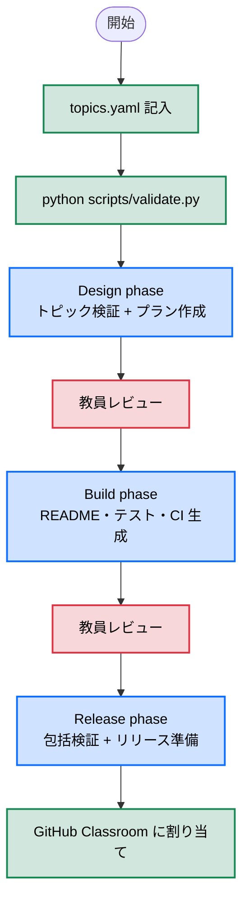

# Python 課題テンプレート

本リポジトリは、学生のプログラミング課題および課題採点用のCIを作成するためのテンプレート・ツールキットです。
AI エージェント（Claude Code / GitHub Copilot / Codex）を使用して、3フェーズで課題リポジトリを効率的に作成できます。

> **エージェント向け情報**: Claude Code は **[CLAUDE.md](CLAUDE.md)**、Codex / GitHub Copilot は **[AGENTS.md](AGENTS.md)** を参照してください。

## クイックスタート

### 1. テンプレートリポジトリの作成

1. GitHub で「Use this template」から新規リポジトリを作成
2. Settings > General で「Template repository」を有効化

### 2. 開発環境の準備

GitHub Codespaces の場合は自動セットアップされます。ローカルの場合:

```bash
pip install -r requirements-dev.txt
```

### 3. 課題トピックの定義

`agent-input/topics.yaml` を開き、課題の基本情報を記入します。

```bash
python scripts/validate.py  # 入力内容を検証
```

### 4. 課題の作成（3フェーズ）

| ツール | Design | Build | Release |
|-------|--------|-------|---------|
| Claude Code | `/design` | `/build` | `/release` |
| GitHub Copilot | `/design.admin` | `/build.admin` | `/release.admin` |
| Codex | `$design-admin` | `$build-admin` | `$release-admin` |

Codex は custom slash command ではなく、repo-local な `.agents/skills/` を明示的に起動して利用します。

## 課題作成ワークフロー



**凡例:** 🟢 手動 / 🔵 エージェント / 🩷 教員レビュー

### Phase 1: Design（設計）

各ツールの Design 起点（`/design`, `/design.admin`, `$design-admin`）で以下を実行:

1. `topics.yaml` のバリデーション
2. シナリオ案の提案（任意）
3. 課題実施方式の選定
4. `agent-output/plan.md` の作成

### Phase 2: Build（構築）

各ツールの Build 起点（`/build`, `/build.admin`, `$build-admin`）で以下を実行:

1. CI 設定の生成（`python scripts/generate.py classroom`）
2. 学生向け `release/README.md` の作成
3. チュートリアルの作成（必要な場合）
4. ステージ別テストの実装と RED→GREEN 検証

### Phase 3: Release（リリース）

各ツールの Release 起点（`/release`, `/release.admin`, `$release-admin`）で以下を実行:

1. 課題の包括的検証
2. 開発用ファイルの削除
3. 学生向けファイルの配置

## リポジトリ構成

```text
.
├── agent-input/
│   └── topics.yaml          # 課題トピック定義（教員が記入）
├── agent-output/             # エージェント出力（plan.md 等）
├── .agents/
│   └── skills/              # Codex 用スキル（自動生成）
├── .claude/
│   ├── commands/            # Claude Code 用コマンド（自動生成）
│   └── skills/              # Claude Code 用スキル（自動生成）
├── .github/
│   ├── prompts/             # GitHub Copilot 用プロンプト（自動生成）
│   └── workflows/           # GitHub Classroom CI
├── plugins/
│   └── python/              # Python テスト規約・CI設定
├── prompts/
│   ├── _shared/             # 共通定義（課題方式、Git規約、レビュー）
│   ├── design.md            # Design フェーズ正本
│   ├── build.md             # Build フェーズ正本
│   └── release.md           # Release フェーズ正本
├── schema/
│   └── topics.schema.yaml   # topics.yaml の JSON Schema
├── scripts/
│   ├── validate.py          # topics.yaml バリデーション
│   ├── generate.py          # Jinja2 テンプレート生成
│   ├── build_prompts.py     # プロンプト自動生成
│   └── release.py           # リリーススクリプト
├── templates/               # Jinja2 テンプレート (.j2)
├── tests/
│   ├── conftest.py          # 動的マーカー登録
│   └── stages/              # ステージ別テスト
├── src/kadai/               # 課題実装ディレクトリ
├── release/                 # リリース用ファイル
├── CLAUDE.md                # Claude Code 用エージェント指示書
├── AGENTS.md                # Codex / GitHub Copilot 用エージェント指示書
└── README.md                # 本ファイル（教員向けガイド）
```

## 課題実施方式

4つの方式から選択できます。詳細は `prompts/_shared/assignment-types.md` を参照:

| 方式 | 概要 | 採点方法 |
|-----|------|---------|
| プログラム実装 | REDテストをGREENにする | CI テスト通過 |
| リファクタリング | GREENテストを維持して品質改善 | AST コード品質チェック |
| テスト実装 | バグのあるコードにテストを書く | バグ検出率 |
| テスト駆動開発 | RED→GREEN→リファクタリング | （現状CI採点なし） |

## スクリプト

| コマンド | 用途 |
|---------|------|
| `python scripts/validate.py` | topics.yaml のバリデーション |
| `python scripts/generate.py <target>` | テンプレートからファイル生成 |
| `python scripts/build_prompts.py` | プロンプトの再生成 |
| `python scripts/release.py` | リリース準備 |

## GitHub Classroom への割り当て

1. [GitHub Classroom](https://classroom.github.com/classrooms) から **+ New assignment** を選択
2. Assignment title、Deadline を設定し **Continue**
3. 作成したリポジトリを選択、visibility を **Private** に設定
4. **Github Codespaces** をサポートエディタとして選択
5. Autograding tests の YAML を確認し **Create assignment**
6. **Copy invite link** を学生に共有

## プロンプトの管理

プロンプトの正本は `prompts/` ディレクトリにあります。`.agents/skills/`、`.claude/commands/`、`.claude/skills/`、`.github/prompts/` は `scripts/build_prompts.py` で自動生成されるため、直接編集しないでください。

```bash
python scripts/build_prompts.py  # プロンプトの再生成
```
